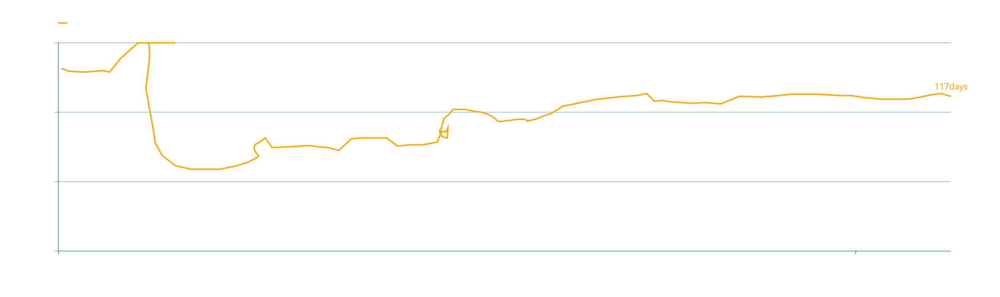

```{r setup, include=FALSE}
knitr::opts_chunk$set(echo = TRUE, fig.width = 6, fig.height = 3.2)

library(tidyverse)
library(lubridate)
library(janitor)
library(dplyr)
library(zoo)

theme_set(theme_bw())
```

```{r, include = FALSE, warning = FALSE}
# google mobility report
mobility <- read_csv("../input/Global_Mobility_Report.csv") %>% 
    filter(country_region == "Brazil") %>% 
    mutate(sub_region_1    = str_remove_all(sub_region_1, "State of "),
           iso_3166_2_code = str_remove_all(iso_3166_2_code, "BR-"))%>%
    mutate_at(vars(contains('baseline')), funs(1 + ./100))


# energy data (não tem RR)
energy <- read_csv2("../input/energia_data.csv") %>% 
    select(Data:`Consumo (MWh)`, -starts_with("12 meses"), 
           -`\"Consumo (MWm)\"`, -Data_Acompanhamento, `Última Data`) %>% 
    rename(ramo = `Ramo de atividade`) %>% 
    clean_names() %>% 
    mutate(data        = as.Date(data, "%d/%m/%Y"),
           ultima_data = as.Date(ultima_data, "%d/%m/%Y")) %>% 
    arrange(data, uf, classe, ramo) %>% 
    group_by(data, uf, estado, classe) %>% 
    summarise(consumo = sum(consumo_m_wh))
    
# https://covid.saude.gov.br/
covid <- read_csv2("../input/HIST_PAINEL_COVIDBR_11jul2020.csv") %>% 
    filter(!is.na(estado)) %>% 
    mutate(date = as.Date(data, "%d/%m/%Y"))


# divide into brazil and states -------------------------------------------
brasil <- covid %>% 
    group_by(date) %>% 
    summarise(last_available_deaths    = sum(obitosAcumulado),
              last_available_confirmed = sum(casosAcumulado)) %>% 
    full_join(mobility %>% filter(is.na(sub_region_1))) %>% 
    select(-starts_with("country_region"), -starts_with("sub_region")) %>% 
    arrange(date)

uf_estado <- owdbr::uflist()

estados <- covid %>% 
    group_by(estado, date) %>%
    summarise(last_available_deaths    = sum(obitosAcumulado),
              last_available_confirmed = sum(casosAcumulado)) %>%
    rename(state = estado) %>% 
    full_join(mobility %>% filter(!is.na(sub_region_1)),
              by = c("state" = "iso_3166_2_code", "date" = "date"))%>%
    select(-starts_with("country_region"), -starts_with("sub_region"),  -starts_with("census_fips")) %>% 
    left_join(uf_estado, by = c("state" = "UF")) %>%
    select(-State)%>% 
    arrange(regiao, state, date)

```

```{r include = FALSE}
# calculate empirical relation --------------------------------------------
# The empirical relationship between mobility and GDP growth rate across economies in the first quarter of 2020 is used to convert a country’s economic activity based on people’s mobility levels.

relation_eq <- function(mobility) {
    activity <- (0.3886 * mobility + 0.61) + 100
}


# doubling days of covid --------------------------------------------------
# More precisely, it is days between the current date (the date at which the measurement is taken) and the most recent prior date at which the confirmed cases were half the current level

nearest_n <- function(x, num) {
    x[which.min(abs(x - num))]
}

doubling_days <- function(half_num, current_date, df) {
    
    # get only previous dates
    half_cases <- df %>% 
        filter(date < current_date)
    
    # get nearest number of cases
    n_half <- nearest_n(half_cases$last_available_confirmed, half_num)
    
    # find last possible date
    last_date <- half_cases %>% 
        filter(last_available_confirmed == n_half) %>% 
        slice(n())
    
    return(last_date$date)
}

# run functions in data ---------------------------------------------------
brasil <- brasil %>% 
    mutate(across(matches("last_available"), ~replace(., is.na(.), 0)),) %>% 
    mutate(half_cum_cases  = last_available_confirmed / 2,
           half_cum_deaths = last_available_deaths / 2)


doubl_dates <- map2(brasil$half_cum_cases, brasil$date, 
                    ~ doubling_days(.x, .y, brasil)) %>% 
    unlist()

brasil_df <- brasil %>% 
    mutate(doubl_dates = c(NA, doubl_dates) %>% as_date(),
           dist_date   = as.numeric(date - doubl_dates),
           mobility    = ((retail_and_recreation_percent_change_from_baseline + 
                          grocery_and_pharmacy_percent_change_from_baseline) / 2 +  
                              workplaces_percent_change_from_baseline) / 2,
           activity    = ifelse(relation_eq(mobility) > 100, 
                                100, relation_eq(mobility)),
           smth_date   = rollmean(dist_date, 7, na.pad = T),
           smth_activ  = rollmean(activity, 7, na.pad = T)
          )

# find bottom of activity
brasil_mob_b <- brasil_df %>% filter(smth_activ == min(smth_activ, na.rm = TRUE))

```


## Replicando para o Brasil  

Como *sanity check*, replicamos o gráfico feito para o Brasil no relatório, utilizando os dados de mobilidade do Google e o número de casos de COVID do país. Usamos a seguinte equação para estabelecer a relação entre os dados de mobilidade e o índice de atividade, baseada no relatório original: 
$$
\text{Atividade} = 0.3886 \cdot \text{Mobilidade} + 0.61
$$
A partir disso, usamos a média móvel de 7 dias do Índice de Atividade construído e do número de dias necessários para duplicar os casos, buscando suavizar a série, conforme indicado.

\vspace{1cm}
```{r echo = FALSE, warning = FALSE}
ggplot(brasil_df, aes(x = smth_date, y = smth_activ)) +
    geom_path(color = "steelblue") +
    #geom_vline(xintercept = 19, linetype = "dotted", size = 0.8) +
    #geom_point(data = brasil_mob_b, shape = 22, fill = "white") +
    ylim(70, 100)+
    xlim(0, 25) + 
    ylab("Daily Economic Activity") + xlab("Doubling days of confirmed cases") 
```

{#id .class width=90% height=100%}

\pagebreak
Aplicando a mesma metodologia para cada um dos estados:
```{r include = FALSE}
doubl_dates_st <- function(df) {
    dates <- map2(df$half_cum_cases, df$date, ~ doubling_days(.x, .y, df)) %>%
        unlist()
    
    df_dt <- df %>% 
        mutate(doubl_dates = c(NA, dates)) %>% 
        mutate(doubl_dates = ifelse(half_cum_cases == 0, NA, doubl_dates) %>% as_date())
    
    return(df_dt)
}

# run functions in data ---------------------------------------------------
# states 
estados <- estados %>%
    mutate(across(matches("last_available"), ~replace(., is.na(.), 0))) %>% 
    mutate(half_cum_cases  = last_available_confirmed / 2,
           half_cum_deaths = last_available_deaths / 2) %>% 
    group_by(state)

# split by state
list_estados <- group_split(estados)

bases_estados_df <- map(list_estados, doubl_dates_st) %>% 
    bind_rows() %>% 
    group_by(state) %>% 
    arrange(date) %>% 
    fill(doubl_dates) %>%
    ungroup() %>%
    arrange(state, date, regiao) %>% 
    mutate(doubl_dates = as.Date(doubl_dates),
           dist_date   = as.numeric(date - doubl_dates),
           mobility    = ((retail_and_recreation_percent_change_from_baseline + 
                          grocery_and_pharmacy_percent_change_from_baseline) / 2 +  
                              workplaces_percent_change_from_baseline) / 2,
           activity    = ifelse(relation_eq(mobility) > 100, 
                                100, relation_eq(mobility)),
           smth_mobility = rollmean(mobility, 7, na.pad = T),
           smth_date   = rollmean(dist_date, 7, na.pad = T),
           smth_activ  = rollmean(activity, 7, na.pad = T)
          )


# find bottom of activity
estados_mob_b <- bases_estados_df %>%
    group_by(state) %>%
    filter(smth_activ == min(smth_activ, na.rm = TRUE))
#export 
write.csv(bases_estados_df, file = "../meta/bases_estados_df.csv")
```

```{r include = FALSE}
plot_activity_mobility <- function(df) {
    
    p <- ggplot(df, aes(x = smth_date, y = smth_activ)) +
    geom_path(color = "steelblue", size = 0.8) +
    #geom_vline(xintercept = 19, linetype = "dotted", size = 0.8) +
    #geom_point(data = brasil_mob_b, shape = 22, fill = "white") +
    ylim(70, 100) +
    xlim(0, 25) + 
    facet_wrap(~ state) +
    ylab("Daily Economic Activity") + xlab("Doubling days of confirmed cases")
    
    return(p)
}


plot_regiao <- function(reg) {
    
    base_regiao <- bases_estados_df %>% 
        filter(regiao == reg)
    
    return(plot_activity_mobility(base_regiao)) 
}
```

## Região Sudeste
```{r echo = FALSE, warning = FALSE, fig.width = 9, fig.height = 6}
plot_regiao("Sudeste")
```

\pagebreak
## Região Sul
```{r echo = FALSE, warning = FALSE, fig.width = 9, fig.height = 3}
plot_regiao("Sul")
```

\pagebreak
## Região Centro-Oeste
```{r echo = FALSE, warning = FALSE, fig.width = 9, fig.height = 6}
plot_regiao("Centro-Oeste")
```

\pagebreak
## Região Nordeste
```{r echo = FALSE, warning = FALSE, fig.width = 9, fig.height = 9}
plot_regiao("Nordeste")
```

\pagebreak
## Região Norte
```{r echo = FALSE, warning = FALSE, fig.width = 9, fig.height = 9}
plot_regiao("Norte")
```

\pagebreak
# Usando dados de energia
```{r echo = FALSE, warning = FALSE, message = FALSE}
data_max <- max(energy$data) - 366

ano_anterior <- energy %>% 
    filter(data >= as.Date("2019-01-01") & data <= as.Date("2019-12-31")) %>% 
    rename(ano_anterior = consumo) %>% 
    mutate(data = data + 365)

total_energy_df <- energy %>% 
    group_by(data, uf, estado) %>% 
    summarise(consumo = sum(consumo)) %>% 
    left_join(ano_anterior %>% 
                  group_by(data, uf, estado) %>% 
                  summarise(ano_anterior = sum(ano_anterior))) %>% 
    filter(data >= as.Date("2020-02-25")) %>% 
    mutate(dif_baseline = consumo - ano_anterior) %>% 
    full_join(bases_estados_df, by = c("data" = "date", "uf" = "state")) %>% 
    group_by(uf) %>% 
    arrange(uf, data) %>% 
    mutate(smth_consumo = rollmean(dif_baseline, 7, na.pad = T))

acl_energy_df <- energy %>% 
    filter(classe == "Consumidor Especial" | classe == "Consumidor Livre") %>% 
    group_by(data, uf, estado) %>% 
    summarise(consumo = sum(consumo)) %>% 
    left_join(ano_anterior %>% 
                  filter(classe == "Consumidor Especial" | classe == "Consumidor Livre") %>% 
                  group_by(data, uf, estado) %>% 
                  summarise(ano_anterior = sum(ano_anterior))) %>% 
    filter(data >= as.Date("2020-02-25")) %>% 
    mutate(dif_baseline = consumo - ano_anterior) %>% 
    full_join(bases_estados_df, by = c("data" = "date", "uf" = "state")) %>% 
    group_by(uf) %>% 
    arrange(uf, data) %>% 
    mutate(smth_consumo = rollmean(dif_baseline, 7, na.pad = T))
```

```{r echo = FALSE, warning = FALSE, message = FALSE}
plot_activity_energy <- function(df) {
    
    p <- ggplot(df, aes(x = smth_date, y = smth_consumo)) +
    geom_path(color = "steelblue", size = 0.8) +
    xlim(0, 25) + 
    facet_wrap(~ uf) +
    ylab("Change from previous year in energy consumption") + xlab("Doubling days of confirmed cases")
    
    return(p)
}


plot_regiao_energia <- function(df, reg) {
    
    base_regiao <- df %>% 
        filter(regiao == reg)
    
    return(plot_activity_energy(base_regiao)) 
}
```


Trocando os dados de mobilidade pela diferença entre o consumo de energia atual e no mesmo dia do ano anterior (em MWh).


## Região Sudeste
```{r echo = FALSE, warning = FALSE, fig.width = 9, fig.height = 6}
plot_regiao_energia(total_energy_df, "Sudeste")
```

\pagebreak
**Somente ACL**  
```{r echo = FALSE, warning = FALSE, fig.width = 9, fig.height = 6}
plot_regiao_energia(acl_energy_df, "Sudeste")
```


\pagebreak
## Região Sul
```{r echo = FALSE, warning = FALSE, fig.width = 9, fig.height = 6}
plot_regiao_energia(total_energy_df, "Sul")
```

\pagebreak
**Somente ACL**  
```{r echo = FALSE, warning = FALSE, fig.width = 9, fig.height = 6}
plot_regiao_energia(acl_energy_df, "Sul")
```

\pagebreak
## Região Centro-Oeste
```{r echo = FALSE, warning = FALSE, fig.width = 9, fig.height = 6}
plot_regiao_energia(total_energy_df, "Centro-Oeste")
```

\pagebreak
**Somente ACL**  
```{r echo = FALSE, warning = FALSE, fig.width = 9, fig.height = 6}
plot_regiao_energia(acl_energy_df, "Centro-Oeste")
```

\pagebreak
## Região Nordeste
```{r echo = FALSE, warning = FALSE, fig.width = 9, fig.height = 9}
plot_regiao_energia(total_energy_df, "Nordeste")
```

\pagebreak
**Somente ACL**  
```{r echo = FALSE, warning = FALSE, fig.width = 9, fig.height = 9}
plot_regiao_energia(acl_energy_df, "Nordeste")
```

\pagebreak
## Região Norte
```{r echo = FALSE, warning = FALSE, fig.width = 9, fig.height = 9}
plot_regiao_energia(total_energy_df, "Norte")
```

\pagebreak
**Somente ACL**  
```{r echo = FALSE, warning = FALSE, fig.width = 9, fig.height = 9}
plot_regiao_energia(acl_energy_df, "Norte")
```
