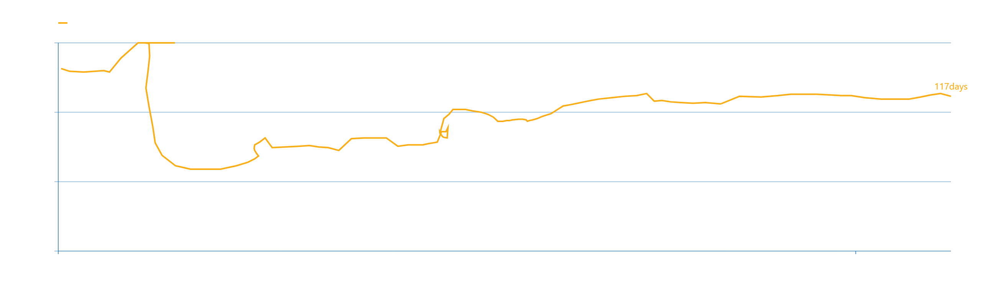

```{r setup, include=FALSE}
knitr::opts_chunk$set(echo = TRUE, fig.width = 6, fig.height = 3.2)

library(tidyverse)
library(lubridate)
library(zoo)

theme_set(theme_bw())
```

```{r, include = FALSE, warning = FALSE}
# google mobility report
mobility <- read_csv("../input/Global_Mobility_Report.csv") %>% 
    filter(country_region == "Brazil") %>% 
    mutate(sub_region_1    = str_remove_all(sub_region_1, "State of "),
           iso_3166_2_code = str_remove_all(iso_3166_2_code, "BR-"))

# brasil.io (caso_full)
covid <- read_csv("../input/caso_full.csv") %>% 
    filter(place_type == "state", is_repeated == FALSE)
    

# divide into brazil and states -------------------------------------------
brasil <- covid %>% 
    group_by(date) %>% 
    summarise(last_available_deaths    = sum(last_available_deaths),
              last_available_confirmed = sum(last_available_confirmed)) %>% 
    full_join(mobility %>% filter(is.na(sub_region_1))) %>% 
    select(-starts_with("country_region"), -starts_with("sub_region")) %>% 
    arrange(date)

estados <- covid %>% 
    select(-city, -is_repeated, -place_type) %>% 
    arrange(state, date)
```

```{r include = FALSE}
# calculate empirical relation --------------------------------------------
# The empirical relationship between mobility and GDP growth rate across economies in the first quarter of 2020 is used to convert a country’s economic activity based on people’s mobility levels.

relation_eq <- function(mobility) {
    activity <- 100 + (0.38*mobility)
}


# doubling days of covid --------------------------------------------------
# More precisely, it is days between the current date (the date at which the measurement is taken) and the most recent prior date at which the confirmed cases were half the current level

nearest_n <- function(x, num) {
    x[which.min(abs(x - num))]
}

doubling_days <- function(half_num, current_date, df) {
    
    # get only previous dates
    half_cases <- df %>% 
        filter(date < current_date)
    
    # get nearest number of cases
    n_half <- nearest_n(half_cases$last_available_confirmed, half_num)
    
    # find last possible date
    last_date <- half_cases %>% 
        filter(last_available_confirmed == n_half) %>% 
        slice(n())
    
    return(last_date$date)
}

# run functions in data ---------------------------------------------------
brasil <- brasil %>% 
    mutate(across(matches("last_available"), ~replace(., is.na(.), 0))) %>% 
    mutate(half_cum_cases  = last_available_confirmed / 2,
           half_cum_deaths = last_available_deaths / 2)


doubl_dates <- map2(brasil$half_cum_cases, brasil$date, 
                    ~ doubling_days(.x, .y, brasil)) %>% 
    unlist()

brasil_df <- brasil %>% 
    mutate(doubl_dates = c(NA, doubl_dates) %>% as_date(),
           dist_date   = as.numeric(date - doubl_dates),
           mobility    = rowMeans(select(., ends_with("baseline"))),
           activity    = ifelse(relation_eq(mobility) > 100, 
                                100, relation_eq(mobility)),
           smth_date   = rollmean(dist_date, 7, na.pad = T),
           smth_activ  = rollmean(activity, 7, na.pad = T)
          )

# find bottom of activity
brasil_mob_b <- brasil_df %>% filter(smth_activ == min(smth_activ, na.rm = TRUE))

```


## Replicando para o Brasil
```{r echo = FALSE, warning = FALSE}
ggplot(brasil_df, aes(x = smth_date, y = smth_activ)) +
    geom_path(color = "steelblue") +
    geom_vline(xintercept = 19, linetype = "dotted", size = 0.8) +
    #geom_point(data = brasil_mob_b, shape = 22, fill = "white") +
    ylim(70, 100) + 
    ylab("Daily Economic Activity") + xlab("Doubling days of confirmed cases") 
```

{#id .class width=90% height=100%}
